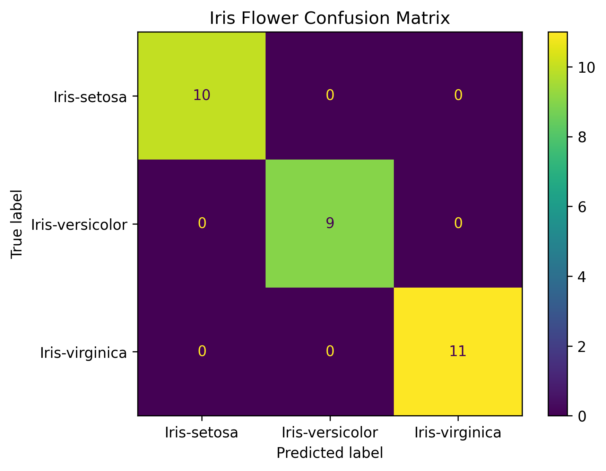

# 🌸 Iris Flower Prediction

A supervised machine learning project developed as part of the **Microsoft Nirmaan Program**.

This project predicts the species of an Iris flower using four flower measurements and a **Logistic Regression** classification model. The trained model is integrated into a **Streamlit web application** for interactive predictions.

## 🚀 Live Demo

**[🌐 Open Iris Flower Prediction App](https://iris-flower-prediction-mmxfyxnegebk6pwe48vnmv.streamlit.app/)**

## 📌 Project Highlights

* **Dataset:** 150 Iris flower samples
* **Features:** 4 — sepal length, sepal width, petal length, petal width
* **Classes:** Iris-setosa, Iris-versicolor, Iris-virginica
* **Algorithm:** Logistic Regression
* **Train/Test Split:** 120 / 30 samples
* **Test Accuracy:** 100% on the evaluated 30-sample test set
* **Evaluation:** Precision, Recall, F1-Score and Confusion Matrix
* **Deployment:** Streamlit
* **Model:** Saved as `.pkl`

## 🔄 Project Workflow

**Data → Preprocessing → Train/Test Split → Model Training → Evaluation → Model Saving → Streamlit Prediction**

## 📊 Model Performance

| Metric       |    Score |
| ------------ | -------: |
| Accuracy     | **100%** |
| Precision    | **1.00** |
| Recall       | **1.00** |
| F1-Score     | **1.00** |
| Test Samples |   **30** |

The model correctly classified all 30 samples in the evaluated test set.

> **Note:** The dataset contains only 150 samples, so the test result should not be interpreted as a guarantee of 100% accuracy on future real-world data.

## 🌐 Application

The Streamlit application allows users to enter the four flower measurements and receive an Iris species prediction.

**Prediction Classes:**

* 🌱 Iris-setosa
* 🌿 Iris-versicolor
* 🌸 Iris-virginica

### Application Preview

[

### Confusion Matrix



## 🛠️ Technologies

**Python · Pandas · NumPy · Scikit-learn · Matplotlib · Streamlit · Git & GitHub**

## 📁 Project Structure

```text
iris-flower-prediction/
├── data/
│   └── iris.csv
├── model/
│   └── iris_model.pkl
├── screenshots/
│   ├── streamlit_app.png
│   └── confusion_matrix.png
├── app.py
├── train_model.py
├── requirements.txt
└── README.md
```

## 🎓 Microsoft Nirmaan Program

This project was developed as part of the **Microsoft Nirmaan Program** to gain practical experience in supervised machine learning, model evaluation, model deployment, and GitHub-based project development.

## 🚀 Future Improvements

* Compare multiple classification algorithms
* Add cross-validation
* Add prediction probability
* Improve the Streamlit interface
* Deploy the application online

## 👨‍💻 Author

**Samarth Kokate**
B.Tech Computer Science Engineering — Data Science

GitHub: **[@s56874](https://github.com/s56874)**

---

⭐ If you find this project useful, consider giving the repository a star.

